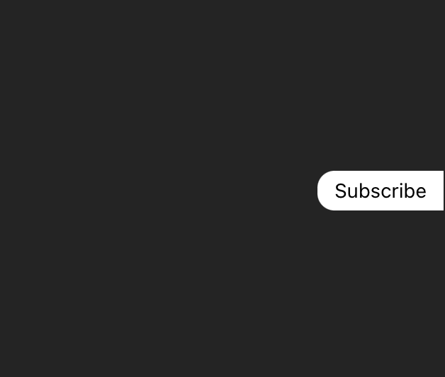
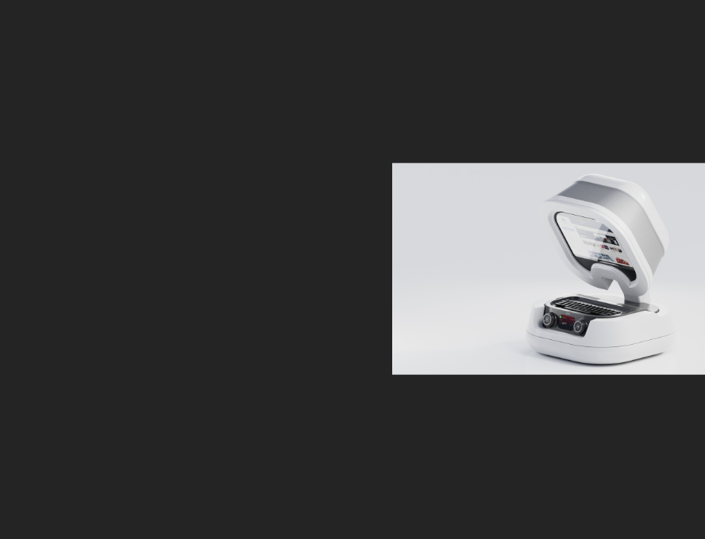

# Ethnical Popups

When was the last time you paid attention to popup content before closing?

This template enables developers to freely implement a non-intrusive site popup pattern that doesn't exacerbate the issue of pop-up intrusion for users.

ie. The dark pattern of immediately overlaying popups on content that a user was visiting you for in the first place, which continues to escalate desensitization to popups and their messaging.

This popup by default sits on the right-hand-side window edge, centered vertically, showing a quick preview (open state) before auto-closing, with a user accessible call to action (ie. 'openText' param) for access.




## Usage

### React

Import a React component:

```jsx
import Popup from 'plugin/path'

...

<Popup {...props} />
```

### Javascript

Import the function-based initialisation for use with any JS framework:

```js
import { Popup } from 'plugin/path'

...

const controls = new Popup(options)
```

### Function-based Controls

```ts
interface PopupControls {
  update(data: AppProps): void;
  remove(): void;
}
```

### Init Options

Function-based initialisation:

```ts
interface InitParams extends AppProps {
  mountId?: string;
}
```

Both Function and Component initialisation:

```ts
interface AppProps {
  openText: string; // html support
  content: string; // html support
  config?: AppConfig;
}

interface AppConfig {
  bgColor?: string;
  zIndex?: number;
  contentRounded?: boolean;
  contentPadded?: boolean;
  autoHideDelay?: number;
  yOffset?: number | string;
}
```
